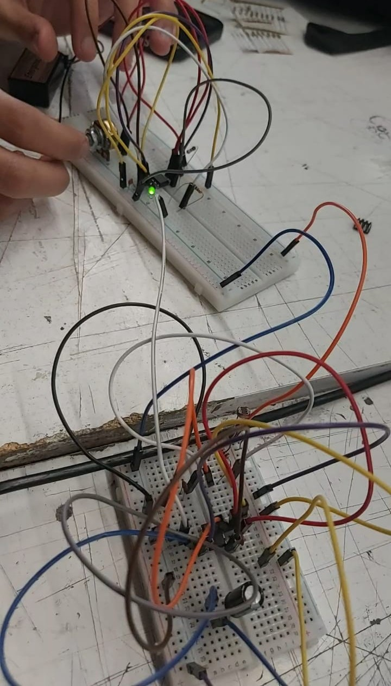

# sesion-03b
Viernes 27 de Marzo

---
## Apuntes

### <ins>Referentes vistos en clase</ins>

#### **Robert forest**
Son útiles sus libros o manuales para referencias. Vivió antes que fuera la era maker, trabajó en una empresa de circuitos y creó un APC.

### <ins>Significado de palabras o para qué sirven ciertas cosas vistas en clase o que no recordaba⁣/ins>
**REQ** = La resistencia equivalente es el valor único que representa la oposición total de varias resistencias en un circuito. Sería la suma de R1 + R2 (ejemplo). En paralelo: Se suman los inversos de las resistencias y luego se invierte el resultado.
**APC** = La Atari Punk Console utiliza circuitos integrados 555 o 556, resistencias y potenciómetros para crear ondas cuadradas y efectos de sonido.
**LDR** = fotoresistor, significa Light Dependent Resistor
### <ins>Tipos de circuitos con el 555⁣/ins>
* Astable = un oscilador en el cual se puede prender o apagar un LED; también se usa con un parlante para producir sonido en base al 555 y qué tan rápido oscila.
* Bistable = Actúa como memoria (conmutador) con dos estados estables (Alto o Bajo). Se requiere un pulso en el pin de disparo para poner la salida en ALTO y un pulso en el pin de reinicio (reset) para ponerla en BAJO
* Monostable: Genera un pulso de salida, retardando así la señal eléctrica o alargándola.

---

### <ins>Experimentación con el protoboard</ins>

Primeramente, realizamos un monostable, al hacerlo, hice que la luz LED siguiera prendida momentáneamente con el botón.

Después realizamos un APC, para esto tuve ayuda de mi compañero Ángel Sabogal, ya que a ambos se nos quemaron el segundo 555 que nos habían dado, pero el circuito funcionaba. Al momento de funcionar, logramos que con el potenciómetro subiéramos y bajáramos el volumen del altavoz, con el LDR hicimos que aumentara y bajara tonos de grave a agudo.

